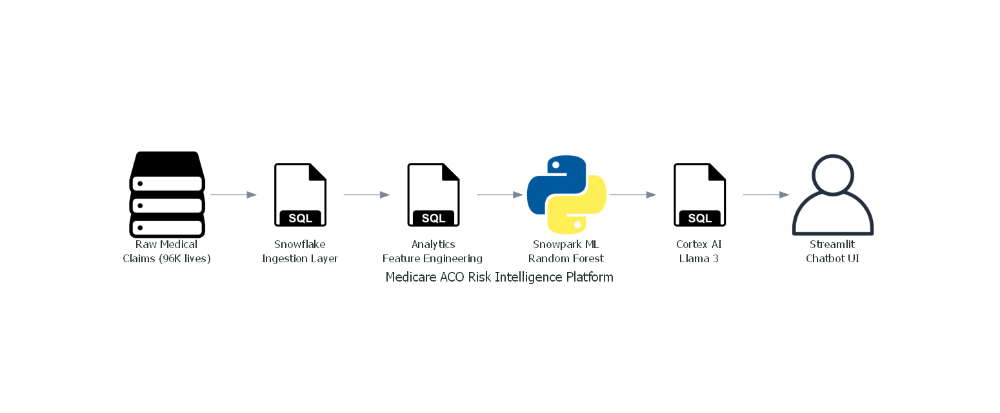

# 🏥 Medicare ACO Risk Intelligence Platform

[](https://snowflake.com)
[](https://python.org)
[](https://streamlit.io)

> A cloud-native data platform for a Medicare ACO managing **96,000 lives** — featuring in-database ML, ELT pipelines, and a Generative AI chatbot.

---

## 🏗️ Architecture



---

## 🎥 AI Chatbot Demo

*Natural language question → SQL query → real-time data visualization*


---

## 🚀 Project Overview

A cloud-native data platform designed for a Medicare Accountable Care Organization (ACO) managing 96,000 lives. Implements a modern ELT pipeline to process medical claims, predict financial risk using in-database ML, and democratize data access via a Generative AI chatbot.

---

## 🏆 Key Features

### 1. Robust Data Engineering
- **Challenge:** Medical claims suffer from grain mismatch (line items vs headers), causing duplicate financial reporting
- **Solution:** Grouping and aggregation logic in the `INGESTION` schema normalizes claims to header level
- **Result:** 100% financial accuracy before downstream processing

### 2. In-Database Machine Learning (Snowpark)
- **Goal:** Move the model to the data, not the data to the model
- **Implementation:** Snowpark Python trains a `RandomForestClassifier` directly inside Snowflake
- **Outcome:** Identifies high-cost patients (>$50k/yr) using Age, Comorbidities, and Historical Utilization

### 3. Generative AI "Chat with Data"
- **Integration:** Snowflake Cortex (Llama 3) as Text-to-SQL engine
- **App:** Streamlit interface — non-technical stakeholders ask plain English questions and get real-time data tables

---

## 📊 Results

| Metric | Value |
|--------|-------|
| Lives Managed | 96,000 |
| Claims Processed | 1.5M+ records |
| Model | Random Forest (Snowpark) |
| Target | High-cost patients >$50k/yr |
| Data Accuracy | 100% (grain normalization) |

---

## 🏗️ Pipeline Flow
```
Raw Claims → Snowflake Ingestion → Analytics Layer → Snowpark ML → Cortex AI → Streamlit UI
```

---

## 💻 How to Run

1. Execute `pipeline_and_ml.sql` in a Snowflake Worksheet to build schemas and train the model
2. Open **Streamlit in Snowflake**, create a new app, paste code from `AI App.sql`
3. Ask questions in plain English to interact with the findings

---

## ⚙️ Tech Stack

- **Cloud Data Warehouse:** Snowflake
- **In-Database ML:** Snowpark Python (RandomForestClassifier)
- **Generative AI:** Snowflake Cortex (Llama 3)
- **Frontend:** Streamlit
- **Language:** SQL, Python

---

## 👤 Author

**Navin Kumar Nagisetty**
📧 navinnagisetty@gmail.com
💼 [LinkedIn](https://www.linkedin.com/in/navinnagisetty/)
🐙 [GitHub](https://github.com/Navin1114-collab)